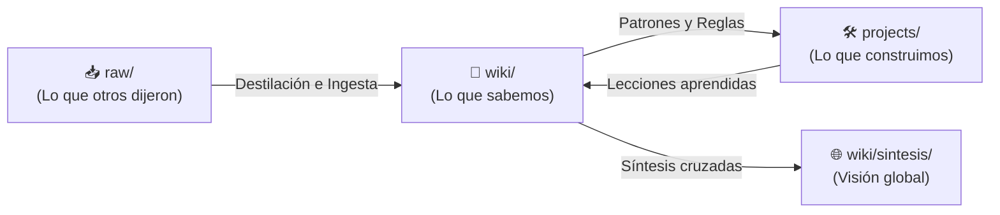
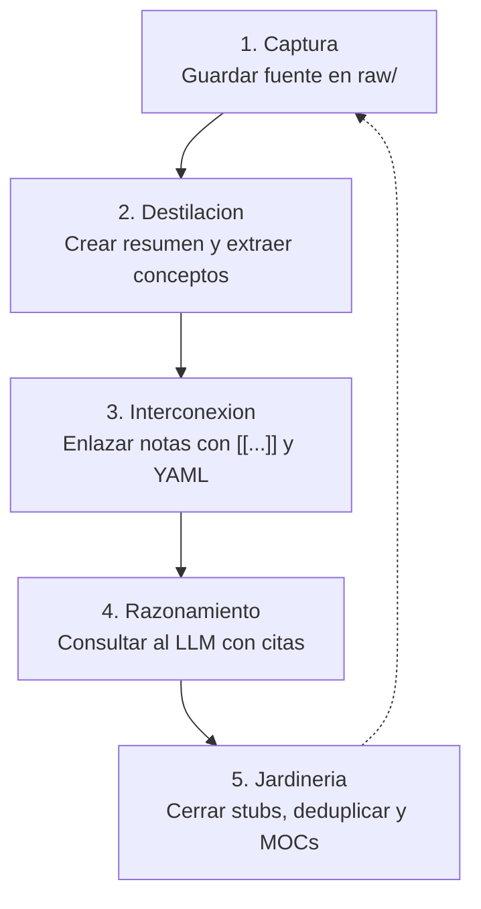

# 📖 Manual de Usuario: Sistema LLM-Wiki

Bienvenido al **Manual de Usuario de LLM-Wiki**. Este documento es la guía operativa exhaustiva para trabajar en este baúl de conocimiento. Aquí aprenderás cómo transformar Obsidian y tus asistentes de Inteligencia Artificial (Claude, Cursor, Antigravity, ChatGPT, etc.) en un **sistema de conocimiento persistente, acumulativo y verificable**, eliminando la pérdida de contexto del chat tradicional.

---

## 🧭 1. Fundamentos y Filosofía Operativa

### El Problema del Chat Efímero
En el flujo habitual de trabajo con LLMs, cada sesión de chat comienza desde cero. Las decisiones de arquitectura, los análisis de lectura y los aprendizajes técnicos se desvanecen en hilos desconectados.

### La Solución LLM-Wiki (El Paradigma Karpathy)
Inspirado en la visión de Andrej Karpathy, este baúl utiliza archivos Markdown locales como la **memoria a largo plazo** y la **fuente canónica de verdad**. El LLM no actúa como un mero autocompletador de texto, sino como un **bibliotecario, analista crítico y custodio activo** de tu conocimiento.



### Las Tres Capas de Conocimiento
1. **`raw/` (Evidencia Histórica Inmutable):** Artículos, transcripciones, especificaciones, notas de reuniones o papers en su formato original. **Queda estrictamente prohibido modificar o recortar archivos en `raw/`.**
2. **`wiki/` (Conocimiento Destilado y Atómico):** Conceptos nucleares, patrones de arquitectura y análisis estructurados, interconectados mediante enlaces bidireccionales (`[[wikilinks]]`).
3. **`projects/` (Espacios Autónomos de Trabajo):** Cada proyecto es un entorno aislado con su propio dominio técnico, fuentes `raw/`, grafo `wiki/`, bitácora `log.md` y agente local.

---

## 🤖 2. Arquitectura de Agentes: Global vs. Local

El baúl opera con una **jerarquía dual de agentes** unificada en [AGENTS.md](file:///home/fdomerlo/Proyectos/fdomerlo/llm-wiki/AGENTS.md):

| Aspecto | 🌐 Orquestador Global | 🛠️ Agente Local de Proyecto |
| :--- | :--- | :--- |
| **Protocolo** | [AGENTS.md](file:///home/fdomerlo/Proyectos/fdomerlo/llm-wiki/AGENTS.md) (raíz) | `projects/<nombre>/AGENTS.md` (derivado de [schema/AGENTS_LOCAL.md](file:///home/fdomerlo/Proyectos/fdomerlo/llm-wiki/schema/AGENTS_LOCAL.md)) |
| **Ámbito de Lectura** | Todo el baúl (raíz, proyectos, esquemas) | Confinado a `projects/<nombre>/` |
| **Ámbito de Escritura** | `index.md`, `log.md`, `wiki/sintesis/` | Exclusivamente `projects/<nombre>/` |
| **Misión Principal** | Meta-índice, síntesis cruzadas, auditorías y coherencia global | Ingesta de fuentes crudas, notas atómicas y consultas de dominio |

> [!IMPORTANT]
> **Frontera de Aislamiento:** El Orquestador Global nunca debe modificar unilateralmente notas dentro de un proyecto sin que el usuario le asigne explícitamente el rol de Agente Local para ese proyecto concreto.

### Proyecto de Referencia Vivo: `projects/mi-baul-obsidian/`
El proyecto [mi-baul-obsidian](file:///home/fdomerlo/Proyectos/fdomerlo/llm-wiki/projects/mi-baul-obsidian) está completamente poblado y sirve como ejemplo tangible (*few-shot*):
- Fuentes originales en `raw/` ([principios Karpathy](file:///home/fdomerlo/Proyectos/fdomerlo/llm-wiki/projects/mi-baul-obsidian/raw/01-principios-karpathy-llm-wiki.md) y [guía operativa](file:///home/fdomerlo/Proyectos/fdomerlo/llm-wiki/projects/mi-baul-obsidian/raw/02-guia-operativa-y-mejores-practicas.md)).
- Notas atómicas interconectadas en `wiki/conceptos/`, `wiki/arquitectura/` y `wiki/entidades/`.
- Comparativa técnica en `wiki/sintesis/` ([Comparativa-LLM-Wiki-vs-RAG.md](file:///home/fdomerlo/Proyectos/fdomerlo/llm-wiki/projects/mi-baul-obsidian/wiki/sintesis/Comparativa-LLM-Wiki-vs-RAG.md)).
- Tablero dinámico en su propio [index.md](file:///home/fdomerlo/Proyectos/fdomerlo/llm-wiki/projects/mi-baul-obsidian/index.md) con consultas Dataview.

---

## 🔄 3. El Procedimiento de Trabajo Diario: Ciclo Metabólico de 5 Fases



### Fase 1: Captura (Capture)
- Coloca la fuente bruta (artículo, especificación, transcripción) directamente en `projects/<proyecto>/raw/<nombre-seguro>.md`.
- No la limpies, no la resumas previamente, no borres nada. Permanece intacta como evidencia legal e histórica.

### Fase 2: Destilación (Distill)
- Invoca al Agente Local para procesar la fuente.
- El agente produce:
  1. Un resumen estructurado en `wiki/resumenes/<nombre-fuente>.md`.
  2. Notas atómicas independientes (una sola idea o patrón por archivo) en `wiki/conceptos/` o `wiki/arquitectura/`.

### Fase 3: Interconexión (Connect)
- Cada nota atómica debe:
  - Vincularse con otras notas existentes mediante `[[Nombre-Nota]]`.
  - Incluir el frontmatter YAML canónico con su nivel de certeza y fuentes.
  - Enriquecer notas existentes en lugar de crear duplicados redundantes (*Principio de Actualización*).

### Fase 4: Consulta y Razonamiento (Query)
- Utiliza al LLM formulándole preguntas basadas en el conocimiento acumulado.
- El LLM debe responder citando notas específicas (`[[...]]`) y distinguiendo hechos de inferencias.

### Fase 5: Jardinería y Mantenimiento Continuo (Gardening)
- Periódicamente (semanal o mensualmente), ejecuta una sesión de jardinería semántica para:
  - Crear notas mínimas para enlaces pendientes (*stubs*).
  - Unificar conceptos sinónimos usando el campo `alias:` en YAML.
  - Crear índices temáticos o Mapas de Contenido (MOC) cuando un tema crezca.

---

## 💼 4. Casos de Uso Prácticos y Catálogo de Prompts

### Caso de Uso 1: Crear un Nuevo Proyecto en el Baúl

#### Cuándo usarlo
Al iniciar una nueva investigación técnica, servicio, librería o dominio de estudio aislado.

#### Procedimiento
1. **Opción A (Desde Obsidian con Templater):**
   - Presiona `Alt + E` (o abre *Templater: Open Insert Template Modal*).
   - Elige `schema/tpl_WIKI.md`.
   - Introduce el nombre del proyecto (ejemplo: `auth-service` o `data-pipeline`).
2. **Opción B (Instrucción al LLM):**
   - Copia y pega el prompt a continuación.

> [!TIP]
> **Prompt para el LLM:**
> ```text
> Actúa como Orquestador Global según AGENTS.md.
> Crea un nuevo proyecto en projects/ llamado "auth-service" siguiendo la estructura y directivas de schema/tpl_WIKI.md.
> Asegúrate de:
> 1. Crear las carpetas raw/, raw/assets/ y wiki/ (con arquitectura, conceptos, entidades, resumenes, sintesis).
> 2. Generar AGENTS.md para el proyecto a partir de schema/AGENTS_LOCAL.md reemplazando las variables.
> 3. Inicializar log.md e index.md con sus consultas Dataview correspondientes.
> 4. Registrar el nuevo proyecto en el meta-índice index.md global y en log.md global.
> ```

---

### Caso de Uso 2: Ingesta de Nueva Evidencia en un Proyecto

#### Cuándo usarlo
Cuando agregas un nuevo paper, transcripción o documentación técnica en `raw/` de un proyecto.

#### Procedimiento
1. Guarda el archivo crudo en `projects/<proyecto>/raw/<identificador-seguro>.md`.
2. Asigna la tarea al LLM invocándolo en modo Agente Local.

> [!TIP]
> **Prompt para el LLM:**
> ```text
> Actúa como Agente Local de "projects/mi-baul-obsidian" según su AGENTS.md.
> Ejecuta el Protocolo de Ingesta sobre la fuente "raw/01-principios-karpathy-llm-wiki.md".
> 
> Tareas requeridas:
> 1. Genera el resumen estructurado en wiki/resumenes/.
> 2. Identifica conceptos y patrones nucleares: si ya existen notas del tema, enriquécelas; si son nuevos, crea notas atómicas usando la plantilla de conceptos o arquitectura.
> 3. Enlaza bidireccionalmente cada nota con wikilinks [[...]].
> 4. Respeta la clasificación de certezas (Hecho, Interpretación, Inferencia).
> 5. Registra la ingesta en projects/mi-baul-obsidian/log.md.
> Recuerda NO modificar bajo ninguna circunstancia el archivo en raw/.
> ```

---

### Caso de Uso 3: Consulta Técnica de Dominio con Respaldo de Fuentes

#### Cuándo usarlo
Para tomar decisiones técnicas, resolver dudas o consultar el razonamiento acumulado sin alucinaciones.

#### Procedimiento
Pide al LLM que responda exclusivamente en base a las notas del proyecto, exigiendo citas precisas.

> [!TIP]
> **Prompt para el LLM:**
> ```text
> Actúa como Agente Local de "projects/mi-baul-obsidian".
> Pregunta técnica: ¿Por qué este sistema prohíbe el consenso artificial entre fuentes contradictorias y cómo se documenta esa discrepancia?
> 
> Instrucciones estrictas:
> - Fundamenta tu respuesta citando las notas relevantes mediante enlaces canónicos [[Nombre-Nota]].
> - Clasifica tus afirmaciones en: HECHO (citando la nota), INTERPRETACIÓN e INFERENCIA.
> ```

---

### Caso de Uso 4: Síntesis Comparativa Transversal entre Proyectos

#### Cuándo usarlo
Cuando tienes múltiples proyectos (por ejemplo, dos microservicios o dos arquitecturas distintas) y quieres contrastar cómo resuelven un problema común (ej. gestión de cache, autenticación, pipelines CI/CD).

#### Procedimiento
Invoca al Orquestador Global. El agente leerá los proyectos y creará la comparativa en `wiki/sintesis/`.

> [!TIP]
> **Prompt para el LLM:**
> ```text
> Actúa como Orquestador Global del baúl según AGENTS.md.
> Ejecuta el Protocolo B (Síntesis Cruzada) para contrastar las estrategias de recuperación de conocimiento entre "mi-baul-obsidian" y [Otro-Proyecto].
> 
> Requisitos:
> 1. Crea la nota en wiki/sintesis/[[Comparativa-Estrategias-Recuperacion.md]] con su frontmatter YAML completo.
> 2. Incluye matriz comparativa de trade-offs, ventajas y desventajas.
> 3. Cita las notas específicas de cada proyecto con [[projects/...]].
> 4. Si hay discrepancias técnicas irreconciliables, documenta el conflicto en el YAML (conflicto_con).
> 5. Actualiza el meta-índice index.md y añade la entrada correspondiente en log.md global.
> ```

---

### Caso de Uso 5: Auditoría Global de Calidad (Linting Documental)

#### Cuándo usarlo
Al final de un ciclo de trabajo o periódicamente para detectar enlaces rotos, rutas obsoletas o índices desactualizados.

> [!TIP]
> **Prompt para el LLM:**
> ```text
> Actúa como Orquestador Global según AGENTS.md.
> Ejecuta una auditoría global del baúl conforme al Protocolo C (Global Lint).
> 
> Verifica:
> 1. Integridad de rutas y ausencia de carpetas o nomenclaturas obsoletas.
> 2. Presencia y salud de index.md, AGENTS.md y log.md en cada proyecto de projects/.
> 3. Enlaces wikilink rotos o huérfanos.
> 4. Formato y campos de frontmatter YAML en todas las notas de wiki/.
> 
> Entrega un reporte estructurado con semáforo:
> - 🟢 Conformes
> - 🟡 Advertencias y sugerencias
> - 🔴 Errores críticos a corregir
> ```

---

### Caso de Uso 6: Jardinería Semántica y Compilación Continua

#### Cuándo usarlo
Para evitar que el grafo de conocimiento se degrade con notas en blanco o conceptos redundantes.

> [!TIP]
> **Prompt para el LLM:**
> ```text
> Actúa como Custodio del Conocimiento y ejecuta el Protocolo E (Jardinería Semántica).
> 1. Detección de Stubs: Localiza enlaces [[...]] mencionados en las notas que aún no tienen archivo físico y propón notas atómicas mínimas basadas en schema/tpl_CONCEPTO.md.
> 2. Deduplicación: Identifica notas con conceptos sinónimos o redundantes y propón unificarlas en la nota canónica añadiendo los términos en el campo "alias:" de YAML.
> 3. Agrupación MOC: Si algún tema acumula más de 5 notas relacionadas, propón un Mapa de Contenido para estructurarlas visualmente.
> ```

---

## ⚖️ 5. Disciplina Epistemológica: Certeza y Gestión de Conflictos

Uno de los mayores riesgos de los LLMs es la **alucinación** y la tendencia a **forzar un falso consenso** ("ambos enfoques son válidos y se complementan"). En LLM-Wiki aplicamos dos reglas de hierro:

### 1. Escala de Certeza Tridimensional
- **HECHO (Fact):** Respaldado unívocamente por evidencia directa en una fuente `raw/` o documento previo del baúl. Cita obligatoria con `[[...]]`.
- **INTERPRETACIÓN (Interpretation):** Análisis técnico, resumen ordenado o abstracción lógica derivada de los hechos observados.
- **INFERENCIA (Inference):** Juicio de valor, predicción, hipótesis o recomendación externa del modelo. Debe marcarse expresamente (`*Inferencia:* ...` o `certeza: media/baja`).

### 2. Prohibición de Consenso Artificial (Preservación de Conflictos)
Si un paper defiende la consistencia estricta mediante base de datos relacional y otro defiende consistencia eventual distribuida:
- **No intentes unificarlos.**
- Documenta las fuerzas en tensión y los trade-offs contextuales en el frontmatter YAML:

```yaml
---
tipo: arquitectura
titulo: Patron de Consistencia Eventual
estado: activo
certeza: alta
fuentes:
  - "[[raw/arquitectura-distribuida.md]]"
conflicto_con:
  - "[[projects/core-bancario/wiki/arquitectura/Patron-Consistencia-ACID]]"
motivo_conflicto: "Trade-off irresoluble del teorema CAP: disponibilidad y baja latencia frente a consistencia transaccional estricta."
---
```

---

## 💡 6. Tips de Productividad y Buenas Prácticas

### Configuración Óptima de Obsidian
1. **Plugin Dataview (Imprescindible):**
   - Habilita *Enable JavaScript Queries* y *Enable Inline Queries*.
   - Permite que los tableros de `index.md` se actualicen en tiempo real mostrando las notas agregadas.
2. **Plugin Templater:**
   - Define la carpeta de plantillas como `schema/`.
   - Usa `schema/tpl_WIKI.md` para crear proyectos con un clic.
3. **Omnisearch (Recomendado):**
   - Búsqueda difusa ultrarrápida que indexa texto, código y texto en imágenes.
4. **Ajustes Nativos de Archivos y Enlaces:**
   - *Default location for new notes:* Carpeta del archivo actual o `raw/`.
   - *Use [[Wikilinks]]:* Activado.
   - *Automatically update internal links:* Activado (renombra enlaces al mover archivos).

### Reglas de Nomenclatura Segura (Safe-Spanish)
- **Escribe en español**, pero en **nombres de archivo, carpetas, claves YAML y etiquetas (`tags`)** no utilices tildes ni `ñ`.
  - ✅ Correcto: `wiki/sintesis/Comparativa-Caches.md`, `tags: [diseno-software]`
  - ❌ Incorrecto: `wiki/síntesis/Comparativa-Cachés.md`, `tags: [diseño-software]`
- **¿Por qué?** Garantiza portabilidad total en Git, scripts de terminal, sistemas de archivos Linux/macOS/Windows y diferentes entornos de ejecución sin corrupción de caracteres.

### El Principio "Enriquecer antes de Duplicar"
Antes de crear una nota atómica:
1. Comprueba si el concepto ya existe (ej. `[[Obsidian]]` o `[[Patron-Arquitectura-LLM-Wiki]]`).
2. Si ya existe, añade una sección o enriquece la nota existente incorporando la nueva perspectiva.
3. Solo crea una nueva nota si se trata de un concepto genuinamente distinto e indivisible.

### Tabla de Frontmatter YAML Canónico
Todas las notas en `wiki/` deben comenzar con:

```yaml
---
tipo: concepto | arquitectura | entidad | sintesis | resumen_fuente
titulo: Titulo Canonico de la Nota
estado: activo | superado | deprecado
ultima_actualizacion: 2026-10-05
fuentes:
  - "[[raw/nombre-fuente.md]]"
tags:
  - tag-sin-tildes
alias: []
certeza: alta | media | baja
conflicto_con: []
motivo_conflicto: ""
---
```

---

## 📋 7. Matriz de Autochecklist y Anti-Patrones Comunes

### 🚫 Anti-Patrones a Evitar (Lista Negra)
- ❌ **Modificar archivos en `raw/`:** La carpeta `raw/` es evidencia judicial inmutable.
- ❌ **Notas "Monstruo":** Crear una nota de 15 páginas que mezcla conceptos, tutoriales y opiniones. Divide siempre en notas atómicas interconectadas.
- ❌ **Notas Huérfanas:** Crear notas sin enlaces entrantes ni salientes. Si una nota no se conecta con el grafo, se pierde en el olvido.
- ❌ **Invasión de Proyectos:** Pedirle a un LLM en rol global que edite notas internas de un proyecto sin cambiar al rol de Agente Local.
- ❌ **Olvidar la Bitácora:** Modificar estructuras o ingerir fuentes sin registrar la entrada en `log.md`.

### ✅ Checklist Previo a Completar Cualquier Tarea
- [ ] ¿He respetado la inmutabilidad de `raw/`?
- [ ] ¿Identifiqué claramente el rol del agente (Global vs. Local)?
- [ ] ¿Tienen las notas en `wiki/` su Frontmatter YAML completo con nivel de certeza?
- [ ] ¿Diferencié los hechos de las inferencias?
- [ ] ¿Respeté la convención Safe-Spanish (sin tildes ni `ñ` en rutas, slugs y tags)?
- [ ] ¿Registré la operación en `log.md` (global o del proyecto)?
