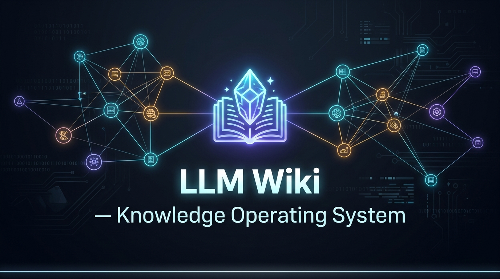

# LLM Wiki — Knowledge Operating System

<p align="center">
  
</p>

Un **Sistema Operativo del Conocimiento personal** basado en **Obsidian + Markdown + Git**, operado bajo el paradigma **"LLM-as-Operator"** y protegido por un kernel determinístico con **cero dependencias externas** (`wikictl`).

Inspirado en la visión de Andrej Karpathy sobre el uso de Modelos de Lenguaje como curadores, bibliotecarios y analistas críticos de una base de conocimiento viva y acumulativa.

---

## 🧭 La Filosofía del Sistema

> **RAW** contiene lo que otros dijeron.  
> **WIKI** contiene lo que sabemos.  
> **PROJECT** contiene lo que estamos haciendo con ese conocimiento.  
> **PUBLISHED** contiene lo que decidimos decirle a otros.

A diferencia de las herramientas convencionales de RAG o chatbots que solo consultan pasivamente archivos, este sistema convierte al LLM en un **asistente activo** que ayuda a estructurar, relacionar, mantener, investigar y convertir el conocimiento en productos derivados, manteniendo la verdad inmutable y versionada con Git.

---

## 🛡️ Principio Arquitectónico Crítico (Aislamiento)

> **EL LLM NUNCA ESCRIBE DIRECTAMENTE SOBRE LAS NOTAS DE LA WIKI.**

Para evitar alucinaciones, enlaces rotos y corrupción silenciosa del grafo, el flujo de incorporación siempre es:

```text
EVIDENCIA (raw/) o PROMPT
       ↓
ANÁLISIS COGNITIVO DEL LLM
       ↓
ARTEFACTO ESTRUCTURADO (.work/ingest/<fuente>.yaml)
       ↓
PLAN DE PROMOCIÓN & DIFF (wikictl promote --dry-run)
       ↓
APROBACIÓN DEL USUARIO
       ↓
ESCRITURA EN DISCO + COMMIT GIT ATÓMICO (wikictl promote --apply --commit)
```

---

## ⚡ Requisitos y Portabilidad: Cero Dependencias

- **Funciona en cualquier plataforma**: Linux, macOS y Windows.
- **Sin `pip install` ni librerías externas**: Utiliza exclusivamente la **biblioteca estándar de Python 3** (`pathlib`, `argparse`, `json`, `difflib`, `re`, `subprocess`, `dataclasses`).
- Clonas el repositorio y lo comienzas a usar de inmediato:
  ```bash
  ./wikictl/wikictl --help
  ```

---

## 📂 Estructura Canónica del Baúl

```text
llm.wiki/
├── AGENTS.md                                   # Protocolo operativo y epistemológico para LLMs
├── README.md                                   # Esta guía
├── docs/                                       # Documentación y especificación fundacional
│   ├── MANUAL_DE_USUARIO.md                    # Manual detallado paso a paso
│   └── PROJECT_FOUNDATION.md                   # Especificación arquitectónica original
├── raw/                                        # Evidencia inmutable (notes, clippings, papers, books)
│   ├── notes/                                  # Notas rápidas y notas nuevas por defecto
│   ├── clippings/                              # Recortes del plugin Obsidian Web Clipper
│   ├── articles/                               # Artículos y lecturas web
│   ├── papers/                                 # Papers académicos
│   ├── books/                                  # Resúmenes y notas de libros
│   ├── transcripts/                            # Transcripciones de audio o video
│   └── attachments/                            # Adjuntos (imágenes, audios, PDFs)
├── wiki/                                       # Conocimiento consolidado y atómico (reutilizable)
│   ├── concepts/                               # Conceptos y modelos mentales
│   ├── people/                                 # Autores y figuras clave
│   ├── technologies/                           # Herramientas, software y protocolos
│   ├── topics/                                 # Disciplinas y áreas temáticas
│   ├── debates/                                # Controversias y contrastes entre fuentes
│   ├── decisions/                              # Registros de decisiones arquitectónicas (ADRs)
│   └── synthesis/                              # Síntesis transversales de múltiples notas
├── projects/                                   # Proyectos concretos (aplicación del conocimiento)
├── published/                                  # Material final para terceros (newsletters, artículos)
├── research/                                   # Investigaciones temáticas en curso
├── .work/                                      # Espacio de trabajo intermedio (ingesta, reportes lint)
└── wikictl/                                    # Kernel determinístico y CLI (wikictl/wikictl)
```

> [!TIP]
> Si borras carpetas vacías o clonas el repositorio en limpio, puedes restaurar toda la estructura canónica en cualquier momento ejecutando:
> ```bash
> ./wikictl/wikictl init
> ```

---

## ⚙️ Configuración Recomendada de Obsidian

Para que Obsidian trabaje en perfecta armonía con el sistema, aplica estas configuraciones en **Ajustes (`Settings`)**:

1. **Ubicación de nuevas notas (`Archivos y enlaces` / `Files and links`)**:
   - *Ubicación de notas nuevas por defecto*: `En la carpeta especificada a continuación` → `raw/notes` (para que cualquier nota creada manualmente o con atajo quede en `raw/` como evidencia preliminar sin procesar).
   - *Ubicación de archivos adjuntos*: `En la carpeta especificada a continuación` → `raw/attachments`.
2. **Enlaces (`Files and links`)**:
   - *Usar [[Wikilinks]]*: **Activado** (`ON`).
   - *Formato de enlaces nuevo*: `Ruta más corta cuando sea posible` (`Shortest path when possible`).
   - *Detectar todas las extensiones de archivo*: **Activado** (`ON`) para ver PDFs, audios y datasets en el explorador.
3. **Obsidian Web Clipper (Extensión de Navegador)**:
   - Configura la ruta de guardado a: `raw/clippings/`
   - Así, cualquier artículo o captura web cae automáticamente como evidencia pura en `raw/` lista para ser analizada e ingesta.

---

## 🚀 Inicio Rápido en 3 Pasos

No necesitas memorizar comandos de consola ni configurar entornos complejos. El sistema está diseñado para que cualquier persona comience a construir su base de conocimiento conversando con su asistente de IA favorito (**Antigravity, Claude Code, Cursor, Aider, ChatGPT, etc.**):

### 1. Abre el repositorio en Obsidian
Clona este repositorio y ábrelo como un Baúl existente (**Open folder as vault**) en Obsidian.
*(Opcional: sigue los 3 ajustes recomendados en la sección [Configuración de Obsidian](#️-configuración-recomendada-de-obsidian) para que tus capturas se guarden ordenadas automáticamente).*

### 2. Agrega tu primer material
Guarda un texto, artículo web, transcripción o nota rápida en `raw/notes/` o `raw/articles/` (o simplemente pega el contenido directamente en tu conversación con el LLM).

### 3. Pídele al LLM que lo incorpore
Dile a tu asistente en lenguaje natural:
> *"Quiero incorporar este documento a la wiki"*

El asistente (instruido automáticamente por el protocolo [`AGENTS.md`](file:///home/fdomerlo/Proyectos/github.com/fdomerlo/llm.wiki/AGENTS.md)):
- Lee y analiza el material distinguiendo rigurosamente **hechos** de **inferencias**.
- Identifica conceptos clave, tecnologías, autores o debates preexistentes.
- Prepara una propuesta estructurada y te muestra un **diff claro y seguro** antes de escribir en disco:
  > *"Propongo crear el concepto `wiki/concepts/descarga-cognitiva.md` y actualizar `wiki/technologies/obsidian.md`. ¿Estás de acuerdo?"*
- Tras tu confirmación (*"Adelante"*), aplica los cambios atómicamente y genera un commit en Git.

---

> [!TIP]
> ### 🛠️ ¿Eres usuario avanzado o prefieres la terminal?
> Para la suite completa de comandos CLI (`wikictl`), flags de automatización (`--dry-run`, `--apply`, `--commit`, `--strict`, `--json`), auditoría manual del baúl y flujos avanzados de investigación y publicación, consulta el **[Manual de Usuario y Guía Avanzada](file:///home/fdomerlo/Proyectos/github.com/fdomerlo/llm.wiki/docs/MANUAL_DE_USUARIO.md)**.

---

## 🧪 Pruebas Automatizadas

El sistema incluye una suite completa de 24 tests unitarios e integrales que validan el parsing de YAML, la resolución multidimensional de enlaces Obsidian, la detección de links rotos, diffs, git commits y todos los subcomandos:

```bash
PYTHONPATH=wikictl/src python3 -m unittest discover -s wikictl/tests
```

---

## 📚 Documentación Adicional

- [Manual de Usuario y Guía Avanzada](file:///home/fdomerlo/Proyectos/github.com/fdomerlo/llm.wiki/docs/MANUAL_DE_USUARIO.md): Referencia completa de comandos CLI, flujos avanzados, automatización y configuración del baúl.
- [Protocolo AGENTS.md](file:///home/fdomerlo/Proyectos/github.com/fdomerlo/llm.wiki/AGENTS.md): Reglas epistemológicas y directivas operativas para agentes.
- [Especificación Fundacional](file:///home/fdomerlo/Proyectos/github.com/fdomerlo/llm.wiki/docs/PROJECT_FOUNDATION.md): Fundamentos teóricos y diseño conceptual original.
