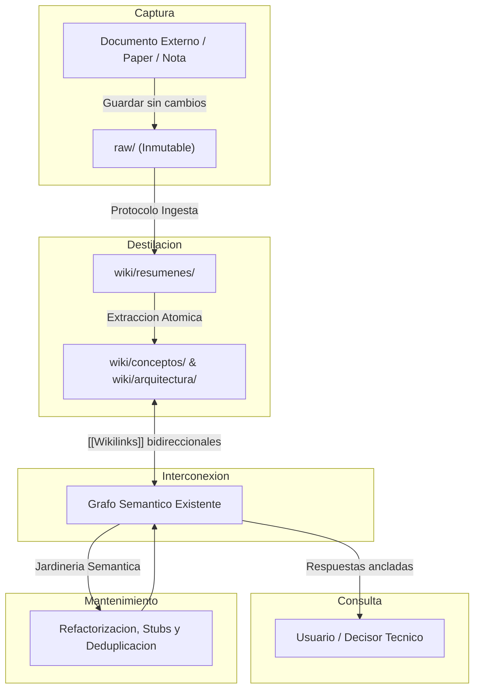

# Flujo Operativo Diario en LLM-Wiki

Este documento describe el **ciclo metabólico de información** que mantiene viva la base de conocimiento sin degradación de calidad a lo largo del tiempo.

---

## El Ciclo de 5 Fases

---

## Detalle de Fases y Roles

### 1. Fase de Captura (Humano)
- **Accion:** Depositar el material de estudio, minutas o transcripciones en `projects/<nombre>/raw/`.
- **Regla:** No gastes tiempo limpiando o formateando el archivo original; el valor de `raw/` radica en su fidelidad a la fuente original.

### 2. Fase de Destilacion (LLM Local)
- **Accion:** El agente local lee la fuente, redacta el resumen en `wiki/resumenes/` y extrae 2 a 5 notas atómicas.
- **Regla:** Respetar la clasificación epistemológica (Hecho vs. Interpretación vs. Inferencia).

### 3. Fase de Interconexion (LLM + Obsidian)
- **Accion:** Toda nueva nota se enlaza con conceptos preexistentes mediante `[[wikilinks]]`.
- **Efecto:** Obsidian actualiza en tiempo real el gráfico de conocimiento y las vistas de enlaces entrantes (*backlinks*).

### 4. Fase de Consulta (Humano + LLM)
- **Accion:** El usuario consulta la wiki para resolver dudas técnicas, redactar especificaciones o tomar decisiones de diseño.
- **Garantía:** El modelo responde citando las notas de la wiki, eliminando alucinaciones y promedios difusos típicos del RAG tradicional.

### 5. Fase de Jardinería Semántica (Mantenimiento Periódico)
- **Frecuencia:** Semanal o quincenal.
- **Acciones:**
  - Resolver *stubs* (enlaces a notas aún no escritas).
  - Unificar términos repetidos con sinónimos en `alias:`.
  - Auditar notas huérfanas mediante las consultas Dataview en `index.md`.

---

## Trazabilidad y Relaciones
- Implementa el [[Patron-Arquitectura-LLM-Wiki]].
- Se apoya en la [[Guia-Inicio-Rapido]].
- Aplica las [[Buenas-Practicas-Curaduria]].
- Permite la materialización del [[Conocimiento-Acumulativo]].
