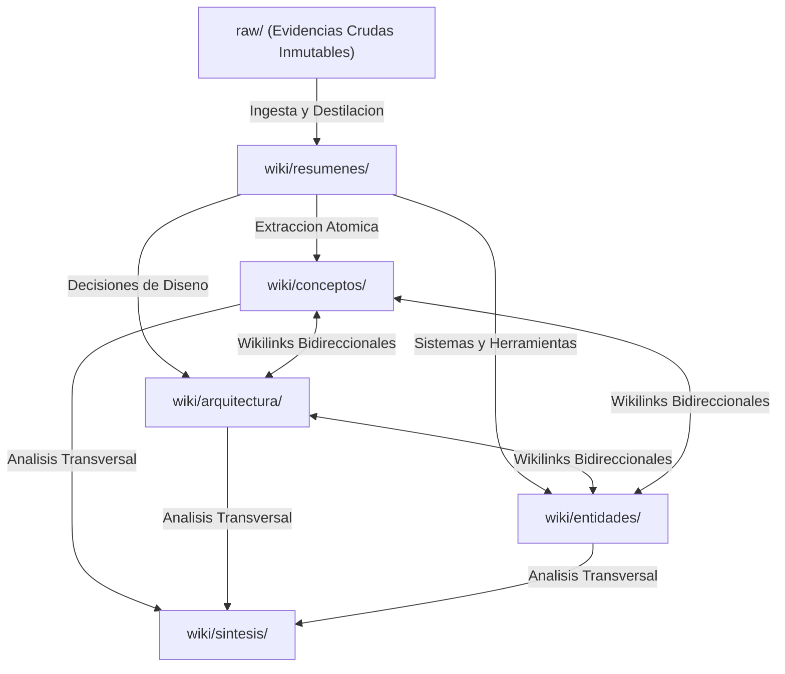

# Patron de Arquitectura LLM-Wiki

Patron estructural que organiza el conocimiento asistido por IA en tres capas con fronteras de seguridad y aislamiento claramente delimitadas.

## Estructura de Capas
1. **Capa Raw (`raw/`):** Almacen de evidencias externas. Solo lectura, inmutable.
2. **Capa Wiki (`wiki/`):** Grafo semantico procesado. Contiene notas atomicas categorizadas (`conceptos/`, `arquitectura/`, `entidades/`, `resumenes/`, `sintesis/`).
3. **Capa Proyectos (`projects/`):** Espacios aislados donde el conocimiento se especializa en contextos operativos independientes.

## Beneficios
- Garantiza la [[Inmutabilidad-Raw]].
- Posibilita el [[Conocimiento-Acumulativo]].
- Se integra de forma natural en [[Obsidian]].
